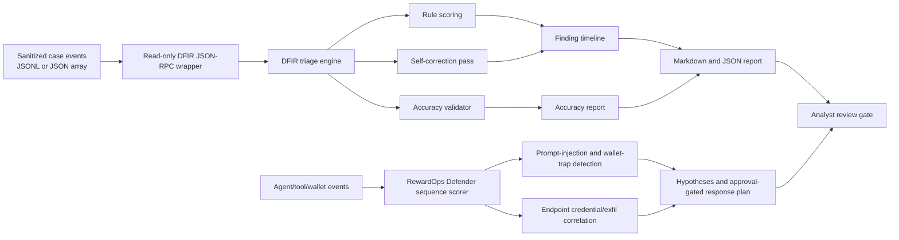

# FIND EVIL Architecture Draft

Status: local prep only. No Devpost account, public repository, video upload, wallet action, KYC, spend, or social action was performed.

Static visual diagrams for repository viewers: `docs/architecture.svg` and
`docs/architecture.png`.

## Boundary Model

- Inputs are local sanitized evidence files only.
- The wrapper exposes read-only tools: `load_case_events`, `triage_case`, `explain_evidence`, and `export_report`.
- It does not probe live hosts, execute malware, use credentials, sign wallets, spend money, or publish artifacts.
- Emails and token-like values are redacted before hashing and reporting.
- Findings are traceable through redacted event hashes and an audit trail.
- Agent/tool/wallet events are treated as untrusted and stored as hashes plus
  structured signals.
- Containment, credential rotation, wallet, payout, account, and publication
  actions remain outside the local execution path.

## FIND EVIL Fit

- Self-correction: private or reserved destination addresses are initially considered for egress, then corrected out of the final finding set.
- Agent defense: prompt-injection and wallet-signing lures are correlated with
  endpoint credential theft and exfiltration in a single timeline.
- Accuracy validation: labelled `expected_rules` in the sample evidence produce precision/recall and missed/unexpected rule counts.
- Accuracy report: `docs/ACCURACY_REPORT.md` documents false positives, missed
  artifact risk, hallucination controls, and evidence integrity.
- Audit trail: every event has a deterministic hash, matched rules, and correction count.
- Terminal demo: the package can be run fully from Linux terminal with Python stdlib only.
